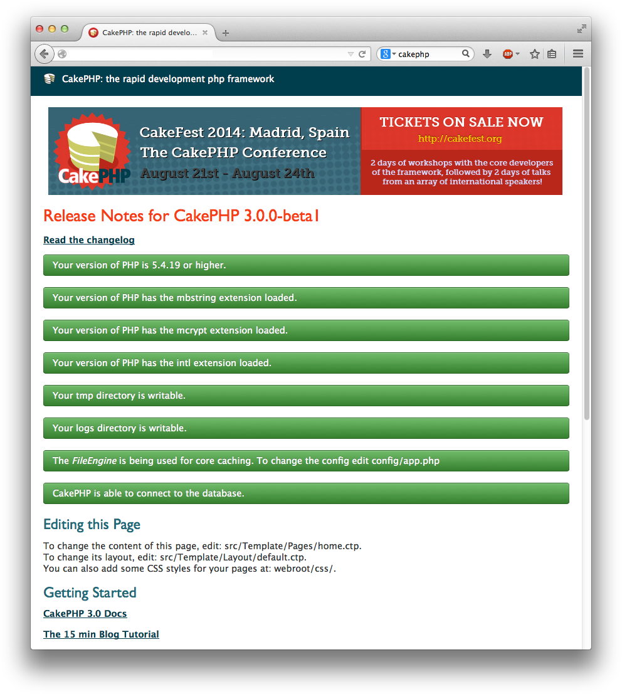

SLP: CakePHP: Getting Started
=============================

[Go up to the main SLP documents page](index.html) ([md](index.md))

To get a CakePHP website up and running:

- Make sure your webserver is configured for CakePHP; you need to have URL rewriting turned on.  See the [VirtualBox image details](virtualbox-image-details.html) ([md](virtualbox-image-details.md)) page for how to do this
    - This has already benn configured on both the VirtualBox image and the course server already
	- You should have installed composer, either locally or globally (it's installed globally on both the VirtualBox image and on the course server)
- You should have your MySQL datbase and login information ready, as you will need that shortly; you should have gotten that in the Collab Post'Em tool
- Install CakePHP, following the directions [here](http://book.cakephp.org/3.0/en/installation.html#installing-cakephp)
    - On the course server, it **MUST** be in `~/html/cakephp/`, or else we will not be able to find it (and we will not grade it); this means that the final URL will be http://server/~mst3k/cakephp/ (where "server" is the course server)
	- So we recommend putting it in `~/public_html/cakephp/` on VirtualBox, and `~/html/cakephp/` on the course server.
	- To do this, run `composer create-project --prefer-dist cakephp/app cakephp` from your `~/public_html` directory (on VirtualBox) or `~/html` directory (on the course server)
	- If your URLs are the same, then you can just do an rsync upload to transfer the files, and they should work on the course server as well; see the [Frameworks homework](hw-frameworks.html) ([md](framework-hw.md)) for details about rsync
- Configure the CakePHP installation
    - There are ***TWO*** .htaccess files (in the root CakePHP directory (`~mst3k/html/cakephp/`) and in the webroot directly below that (`~mst3k/html/cakephp/webroot/`)), and both will need to be edited and a line like `RewriteBase /~mst3k/cakephp/` put in (edited for your particular directory/URL).  Put this in as the second to last line, just above the `</IfModule>` line.
    - At this point, you should be able to view your URL, although it will indicate that it cannot connect to the database
    - In config/app.php, edit app.php, and edit the Datasources =&gt; default array: you will need to change the values for username, password, and database to match your MySQL credentials (both username and database are your userid for this homework; your password is from above)
- At this point, you should be able to view the page (`http://localhost/~mst3k/cakephp/`, or similar).  It will look much like the image below, although the particular colors and layout change with each minor version.
    - For CakePHP 3.3 (the version as of August 2016), it will have a large red area that says, "CakePHP / Build fast, grow solid. / Get the Ovens Ready".  Beneath that will be another large light blue area that has green checkboxes for **EVERY** line (make sure the 'CakePHP is able to connect to the database' one is green also!).
    - Note that all the check marks are green!  If **ANY** of them are yellow or red, then something is wrong, and it is not configured properly (the small yellow box that mentions debug mode is fine).

### Troubleshooting ###

If you are getting "internal server error", "Not Found", or "404: File Not Found" messages when viewing your CakePHP site, there are two things to try:

- make sure your .htaccess file has the RewriteBase line added
- view the Apache error logs - see the [Linux Administration Howtos](linux-admin-howtos.html) ([md](linux-admin-howtos.md)) page for how to do this

### That image ###

