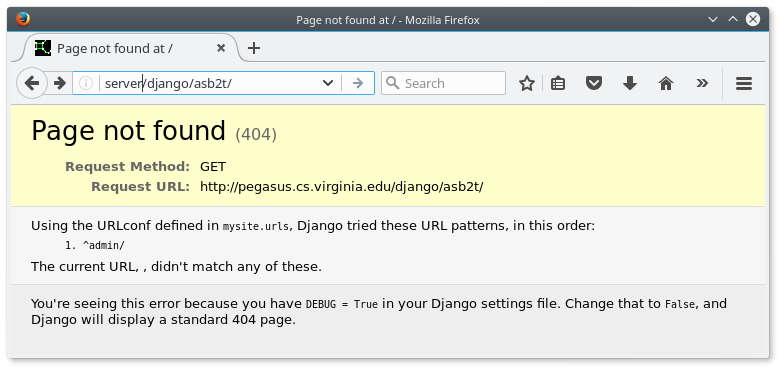

SLP: Django: Getting Started
============================

[Go up to the main SLP documents page](index.html) ([md](index.md))

### Python version

On both the course server and the VirtualBox image, there are two versions of python installed.  It is the system default version (`python -V`) that is used in the WSGI module (which is what runs the Django project in the web server).  As of the writing of this tutorial, that is version 2.7.12.  Running `python3 -V` indicates that Python 3.5.2 is also installed.  These are the defaults for a stock version of Ubuntu 16.04 as of the writing of this document (August 2017).

### Install Django

Django has already been installed on the VirtualBox image provided, the docker image provided, as well as on the course server.

To install Django on your own system, under Ubuntu 16.04, you need to install pip, the Python package manager: `sudo apt-get install python-pip`.  If it is not installed, you will also want to install the `python-mysqldb` package so that Python can connect to the MySQL database.  You can then install Django via `sudo pip install Django==1.11` (you may want to see if there is a newer release available than 1.11, which was the most recent release as of the writing of this document).  Note that installing the python-django package under Ubuntu will NOT work, as that is a previous Django version.


### Setting up a new Django project

Much of these directions are based on the [Django intro tutorial](https://docs.djangoproject.com/en/1.11/intro/) from [Django Project](https://www.djangoproject.com/).  These directions are for Django version 1.11; if a newer version is released, then and you have to change the tutorial page version, via the link in the lower right, to 1.11, which is the version we are using.

To create a Django project, follow these steps.  They are adapted from [part 1 of the Django tutorial](https://docs.djangoproject.com/en/1.11/intro/tutorial01/).

1. Enter `django-admin startproject mysite`.  This will create a `mysite/` directory with a bunch of files in it.
    - For the [Frameworks homework](hw-frameworks.html) ([md](hw-frameworks.md)), you probably will want to use "djangohw" as the project name
	- You will need to change all instances of "mysite" in these directions to your actual project name ("djangohw", or whatever).
    - Note that you can call the binary `django-admin` or `django-admin.py`, as the former just invokes the latter.
	- The Django directory that is created should be in your home directory on the course server.
2. To view your project, you can run `python manage.py runserver` from inside the `mysite/` directory.  This will print a URL, such as `http://127.0.0.1:8000/` -- you can view that URL in your browser, and it should look exactly like the image at the very bottom of this page.  This will only work locally, though -- you can't view a Django project shown via the "runserver" command from the course server very easily (at least, not without redirecting ports).
3. To update the database information, edit `mysite/mysite/settings.py`
    - To use MySQL, change the `ENGINE` value in `DATABASES` from `django.db.backends.sqlite3` to `django.db.backends.mysql`
	- Enter values for your DB credentials: `USER`, `NAME`, `PASSWORD`, and `HOST`.
	- A completed `DATABASES` section might look like the following:
```
DATABASES = {
        'default': {
            'ENGINE': 'django.db.backends.mysql',
            'NAME': 'mst3k',
            'USER': 'mst3k',
            'PASSWORD': 'password',
            'HOST': '127.0.0.1',
        }
}
```
	- Note that there is no easy way to add a DB table prefix to every table -- instead, you would have to specify the name of *every* table that Django uses.  You can see a whole bunch of people getting all twitchy over this [here](https://code.djangoproject.com/ticket/891).
    - And edit `TIME_ZONE` to match our time zone (EST).
4. From the `mysite/` directory, run `python manage.py migrate`.  This will set up the DB tables.
    - The 'superusers' that it prompts you for are a login for your web system -- you can use your userid, and pick any password that you'd like.  Note that by setting the username and password here, you can skip the "Create an admin user" section at the top of [page 2 of the Django tutorial](https://docs.djangoproject.com/en/1.11/intro/tutorial02/).

At this point, you Django project is up and running, even if it doesn't do much.  You can now start about half-way down on the [Django tutorial, part 1](https://docs.djangoproject.com/en/1.11/intro/tutorial01/#creating-models) page (start at the "Creating models" section).

### Viewing it locally

As mentioned in [part 1 of the Django tutorial](https://docs.djangoproject.com/en/1.11/intro/tutorial01/), to view your Django project locally, you run `python manage.py runserver`, and then view it in the URL provided (likely `http://127.0.0.1:8000/`).

### Registering the Django project with Apache on the course server

When running it locally, you view it via `python manage.py runserver`.  But on the course server, you will have to configure it run through the apache web server.  These directions are specifically for the course web server; the [VirtualBox image](virtualbox-image-details.html) ([md](virtualbox-image-details.md)) has *NOT* been configured to allow this to work (on the VirtualBox image, just use the "runserver" command).

When you have created your Django project, you will need to tell the web server that your file exists.  The module that runs Python projects on the Apache web server is called WSGI (Web Server Gateway Interface), pronounced "wus-gee".  On the server, there is a `wsgi-admin` command-line tool to do exactly that, since you can't edit the web server configuration files yourself.  Note that you can only have one WSGI project registered at a time.  You will need to find the wsgi.py file in your Django project (likely in `mysite/mysite/wsgi.py`, where `mysite` is the name of your Django project).

There are four main "modes" to that command:

- `-register` will register a wsgi file, supplied with the `-file` flag
- `-list` will list your existing entry, including the ID (which is needed to remove that entry)
- `-remove` will remove a previously registered wsgi file via entry's ID number, which is specified via the `-id` flag
- `-regenerate` will regenerate the web server configuration files and reload the web server.  This is automatically done on a `-register` or `-remove`.  But it could be the case that somebody accidentally deleted their Django project files, which will cause the WSGI module to cause **ALL** of the WSGI projects to stop working -- the `-regenerate` command will re-create the configuration files without the missing Django projects.

There are a few other flags to the above:

- `-file <wsgi_file>` specifies which file to register; it must be the `wsgi.py` file
- `-id <id_num>` will remove the wsgi file entry with the specified *integer* ID; the IDs can be found via the `-list` flag
- `-compact` will cause the output of the `-list` to be one line per entry
- `-staticdir <dir>` specifies what the static directory is; this must be a full path name (the default is a static/ sub-directory under the main project directory)

Lastly, there are a few flags that are restricted as to who can use them (meaning only the root user can call these flags):

- `-uid <uid_num>` will register the wsgi file as a different user (you can find the UID of a user via `getent passwd <user>`)
- `-nocheck` will skip the check as to whether the passed wsgi file is a valid wsgi file or not
- `-root` will register the file as http://server/user, rather than http://server/django/user
- `-all` will list all the registered wsgi files, including the ones that have been removed

So, to register your file for the tutorial:

```
wsgi-admin -register -file mysite/mysite/wsgi.py
```

It doesn't matter what directory you run this command from, as long as you specify the correct wsgi.py file -- there is only one in the Django project directory that you have created.  Once done, you should be able to view the project online at http://server/django/mst3k/, where "mst3k" is your userid.  Note that this URL will give you a "Page not found (404)" error on a *YELLOW* background, which is because you have not set up your routing properly.  This means that the web server is properly reading your Djagno project, but that your project is not yet properly configured (more on this below).  If you get a "Not Found" error on a *WHITE* background, then either the URL is wrong, or you entered the wrong wsgi-admin command parameters.  If you view http://server/django/mst3k/admin, it will present a Django administration login screen, and you can log in with the superuser information that you entered when you created the Django project (step 4 under "Setting up a new Django project", above).

To find the existing entries that you have:

```
wsgi-admin -list
```

Note that that command will also tell you the ID of your entry, which is a positive integer.  Also note that you can only have one entry per account, so you will have to remove an existing entry if you want to create a new one (or if you want to change any of the settings).

To remove your entry, assuming it has an ID 42 (the ID is found via the `wsgi-admin -list` command):

```
wsgi-admin -remove -id 42
```

Once the system is registered properly, you can view the site at http://server/django/mst3k; you will get the following image.  We'll get it working properly in the "Configuring the Django project" section, below.



### Updating the Django project

If you have updated your Django project -- meaning you have edited *any* of the files -- then you will need to tell the web server that this has occurred.  While you can reload the web server (via the `reload-apache2` command), it's much better to update the timestamp on your wsgi.py file.  To do this, use the `touch` command:

```
touch ~/mysite/mysite/wsgi.py
```

This will update the timestamp on the wsgi.py file to the current time.  The web server (actually the WSGI module) will detect this, and reload the project.

If you are still running into problems (such as Internal Server Errors (500)), try reloading the web server via `reload-apache2`.

### SQLite to MySQL

If you used the docker image, then you likely kept the data for the app in a SQLite3 database.  You can use the framework's command to create the tables.  You can use the [.dump command](http://www.sqlitetutorial.net/sqlite-dump/) to extract the data, and then enter it into the MySQL database on the course server.  If you are unsure what the format of the database configuration file should be, create a new app (with a different name) that uses MySQL, and look at the file therein for the format (or just copy the database configuration file over).

## Configuring the Django project

While the project works, many things will still need tweaking.

##### Setting the static directory

If you look at http://server/django/mst3k/admin (notice the "/admin" at the end), it will look like the following:


You will note that there is no formatting, as the various files needed for that formatting (images, CSS files, etc.) can not be found.  These files are called *static files*, as their content does not change (much).

There are many static files that are needed for a Django project; these are described in more detail in [part 6 of the Djago tutorial](https://docs.djangoproject.com/en/1.11/intro/tutorial06/).  Normally, the static files are found in http://server/static.  However, as there are many Django projects running on this web server, there are many *different* static directories, and thus the URL is different: ours will be at http://server/django/mst3k/static.

This tutorial assumes that your static files are going to be kept in a `static/` sub-directory of your project directory (i.e., the `static/` directory is in the same directory as the `manage.py` file).  You do not need to make that directory yet; that will be done below.  The wsgi-admin program, which you used above, makes that assumption (where your static directory is) as well.  If you want your static directory in a different location, then you will need to re-run the wsgi-admin program (after removing your current entry) and use the `-staticdir` flag, which is described above.

You need to tell the Django project where these files are.  In the settings.py file (which you edited above), you will need to add the following two lines.  The first, `STATIC_URL`, is the URL where the static files are found; the second, `STATIC_ROOT`, is the *filesystem* path where the files are found.

```
STATIC_URL = '/django/mst3k/static/'
STATIC_ROOT = '/home/slp/mst3k/mysite/static/'
```

Lastly, you need to put all the necessary static files into the correct directory (again, presumably /home/slp/mst3k/mysite/static/).  To do this, run (from the main project directory):

```
python manage.py collectstatic
```

You will have to confirm that it intends to overwrite files.  This command also creates the /home/slp/mst3k/mysite/static/ directory.

Lastly, reload the project (`touch mysite/wsgi.py`), and view the admin page again (http://server/django/mst3k/admin); it should look *exactly* like the following, other than the userid (if it does not, then something went wrong):


Once that is done, the tutorial (specifically, [part 6](https://docs.djangoproject.com/en/1.11/intro/tutorial06/)) proceeds normally, and no changes to the tutorial are needed.

##### Configuring the Django project's URLs

This section assumes that there is a `polls` app in the project, which is what is done in the tutorial that is part of the [Frameworks homework](hw-frameworks.html) ([md](hw-frameworks.md)).  If you made a different named app, just replace "polls" with the app name in the instructions below.  This section also assumes you have a default view (we'll use `index`) for that app.  This is done in the first half of [page 3 of the Django tutorial](https://docs.djangoproject.com/en/1.11/intro/tutorial03/).  If you have not yet added that app *and* that view to the project, then this won't work -- come back to this spot in the instructions when you have added that app (and view).

Currently, http://server/django/mst3k gives a page not found error, but http://server/django/mst3k/polls works; we are going to redirect the former to the latter.  The first half of [page 3 of the Django tutorial](https://docs.djangoproject.com/en/1.11/intro/tutorial03/) had you create a polls/urls.py to add the index view.  In addition, it had you edit mysite/urls.py to add a "polls" line -- this told Django how to route one to the polls app.  What we are going to do is to tell Django that if you view the *entire* project (at http://server/django/mst3k) to *also* route one to the polls app.

To do this, add a the following line to the following into that urlpatterns array (above the existing 'polls' line):


```
    url(r'^', include('polls.urls', namespace="polls")),
```

This will cause the base URL of the Djagno project (http://server/django/mst3k) to display the contents of the polls app.

### Initial Djano project image (but only via the "runserver" command!)

If you are running this on the course server, then you will *NOT* see this page.  Instead, verify that you can see the http://server/django/mst3k/admin, which should look like the images above.


