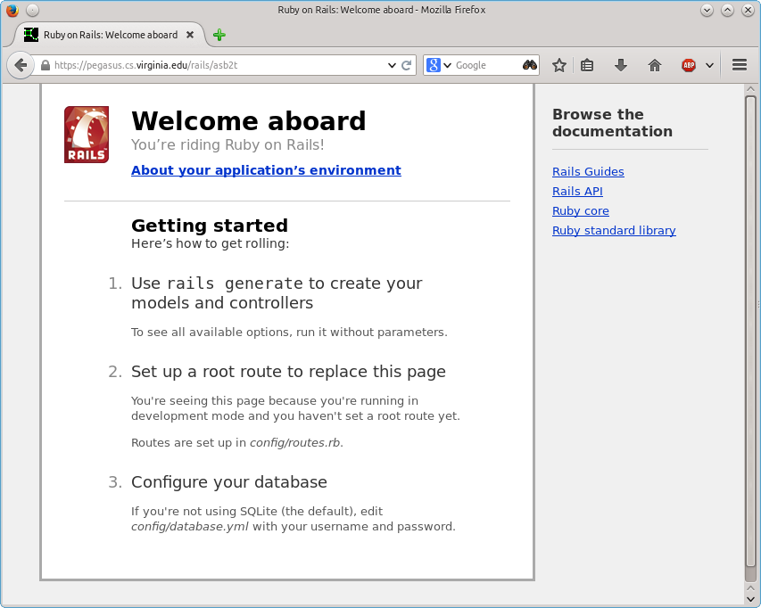

SLP: Ruby on Rails: Getting Started
===================================

[Go up to the main SLP documents page](index.html) ([md](index.md))

Ruby is the programming language, and Rails is the framework.  They are typically used at the same time, so the entire setup is often just called "Rails".

### Install Ruby and Rails

Note that Ruby is the programming language, and Rails is the framework.

The correct versions of Ruby and Rails have already been set up properly on the VirtualBox image and on the docker image.

If you are running this on your *own* machine, then you will want to follow the instructions at [https://gorails.com/setup/ubuntu/16.04](https://gorails.com/setup/ubuntu/16.04) if you are running Ubuntu 16.04.  If you are running Mac OS X, that site has directions [here](https://gorails.com/setup/osx).  Likewise, other versions of Ubuntu can be found from those two links.  If you are using another operating system, you are on your own (but note that the versions ***MUST*** match what we are using (Ruby 2.4.1 and Rails 5.1.3)).  It's okay if you have a more recent patch level version (i.e., Ruby 2.4.2 or rails 5.1.4, for example), but you can't have a different minor or major version.

### Setting up a new Rails app

To set up a new Rails app, you will need to follow the "final steps" instructions from [here](https://gorails.com/setup/ubuntu/16.04).  Specifically:

1. Run `rails new railshw -d mysql`, where "railshw" is the name of the app you are creating
    - For this homework, your Rails app MUST be named "railshw", and it MUST be in your home directory, as this is how the web server is configured.  In particular, there must be a ~mst3k/railshw/public directory.
    - For your project (when you are assigned to your project later), the name of the Rails app should match your project tag
    - If it asks you for your password for sudo, hit Control-C.  It wants to install the Ruby gems (the libraries) system-wide, and we are going to do it in your individual user account.  To do this, enter `cd railshw` to move into the Rails application directory that you just created, then enter `bundle install --path vendor/bundle`.  This will take a minute or two to complete.
    - If you running it through the docker image, then eliminate the `-d mysql` -- this will force it to be a SQLite3 database, and you will transition to the MySQL database when you move to the course server.
2. Edit `railshw/config/database.yml`, and enter your MySQL credentials (change username, password, and database).  For now, change ***all*** the fields (username and password appear twice, and database appears three times).  You can keep the same database (the same name as your userid) for production and development (as this is just a homework -- you should **NOT** do that in practice), and use a different database (such as `mst3k_test`) for testing.  For the homework, you can list your password in plaintext in that file.  However, for your project app, you are ***NOT*** to have the plain text passwords in the files in the repository -- see the Security section, next, for how to handle the password.
3. From the railshw/ directory, run `bundle install` (or, if on the course server, `bundle install --path vendor/bundle`).
4. From the railshw/ directory, run `rake db:create`.  It will say that 'mst3k already exists' or 'mst3k_test already exists', once or twice -- that's fine.

If you are running this on the course server, you will need to reload the apache web server by running `/usr/local/bin/reload-apache2`.  At this point, you should be able to view your Rails app at `http://server/rails/mst3k`.  Note that there is no tilde ("~") there!  And obviously replace "mst3k" with your userid.  It should look ***exactly*** like the image at the bottom of this page.

If you are running this on your own machine, you may need to run `gem install bundler` as root (as indicated [here](http://stackoverflow.com/questions/19061774/cannot-load-such-file-bundler-setup-loaderror)); this was already done on the course server.

### Security

There are a few values that must ***NOT*** be kept in the repositories -- they are the MySQL passwords in config/database.yml, and the secret\_key\_base in config/secrets.yml.  The default files for config/database.yml and config/secrets.yml access environment variables, but the Apache Passenger module doesn't handle those very well for individual users.

The easiest way is to copy secrets.yml to secrets.yml.template, and like for database.yml to database.yml.template.  Edit the actual files (i.e., not the templates), and put the passwords or keys directly into those files.  Add the two *.template files via git, but do NOT add the database.yml and secrets.yml files.  Create a .gitignore file that lists two lines, which are the names of those two files (database.yml and secrets.yml).

What this does is commit to the git repo the tempaltes, but the actual files -- the ones with the passwords -- are not kept in the repo.  This means, however, that each person who checks out the repo will have to set those values manuall.

For those who are interested, there are more options listed [here](http://railsapps.github.io/rails-environment-variables.html).  Keeping this information in environment variables, which is the recommended way to handle this, causes conflits with how Passenger works (Passenger is the Apache module that runs your Rails app)

### Installing new gems

1. Edit the Gemfile, and add the line to add the gem: `gem 'foobar', group: :development`, or similar
2. Run `bundle install`
    - If you are on the course server, `bundle install --path vendor/bundle` instead
3. If you are running it locally, you should be able to view your app through `rails server`
4. If you are on the course server, reload the apache web server by running `/usr/local/bin/reload-apache2`

### Uploading to the server

- Upload the files to pegasus: `rsync -a railshw/ mst3k@server:~/railshw`
    - The syntax for that command (such as all the forward slashes) must be exact!
- Log into pegasus: `ssh mst3k@server`
- Move into the railshw/ directory that was just created when we uploaded the directory: `cd railshw` and install the gems: `bundle install --path vendor/bundle`
  - At this point, you should be able to view your application

If you see a Passenger error with "wrong ELF class" listed there, then you are running a 32-bit machine locally, and the course server is 64-bit.  In the project directory, run `/bin/rm -rf vendor/bundle` and then reinstall the gems (as above, with `--path`).

You may need to transfer the DB, or run db:migrate, depending on the details of your app

### SQLite to MySQL

If you used the docker image, then you likely kept the data for the app in a SQLite3 database.  You can use the framework's command to create the tables.  You can use the [.dump command](http://www.sqlitetutorial.net/sqlite-dump/) to extract the data, and then enter it into the MySQL database on the course server.  If you are unsure what the format of the database configuration file should be, create a new app (with a different name) that uses MySQL, and look at the file therein for the format (or just copy the database configuration file over).

It may be that the SQLite dump does not work well under MySQL.  One option is to edit the dump extensively, but that is long and annoying to do.  Another option is to migrate the DB through the framework on the course server, and re-enter the data into the DB (from the tutorial, copy and paste all the insert commands).

### Troubleshooting

If you get a Passenger error on the server that states, "wrong ELF class", as shown [here](images/rails-bad-elf.png), then the problem is that you have installed all of your gems (via `bundle install --path vendor/bundle`) on your local ***32-bit*** machine or image, and then uploaded them to the server, which is a 64-bit machine.  To fix, you must delete the ***entire*** bundle directory on the server: `/bin/rm -rf ~/railshw/vendor/bundle`, and then reinstall them all again (via `bundle install --path vendor/bundle`).

### Viewing your Rails application

If you want to view your rails application locally, you can view it via the rails server, as described in [those directions](https://gorails.com/setup/ubuntu/16.04) (basically, run `rails server`, and then view it at `http://localhost:3000` in your favorite web browser).

Your Rails app will have a VERY specific directory that it must be installed in, as the web server is already configured for that directory.  As long as it is in that directory, it will be visible through Apache.

When you view your app, it should look ***exactly*** like the image at the image below (albeit with a different URL):

